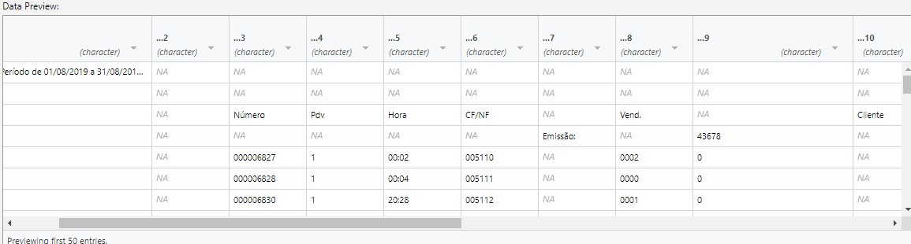
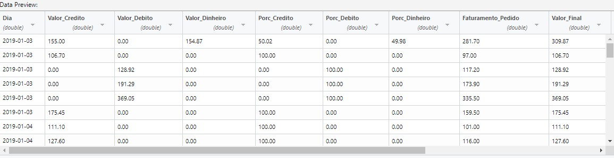

*** This is a private work, data isn't avaliable, code only ***

# B.I - description

Work done to a local restaurant with financial and operational problems. We collected financial and operational data from one year in a unstructured state, with over 50 sheets of information without standardize practices and unconsolidated data.

The code avaliable for this projects aggregate and prepare the data for the B.I analysis in clean databases.
The analysis and visualization of the data was done in Power BI in partnership with Richard Silva. Our final results gave a important overview of the main problems in the restaurannt, our client was pleased with the results.

The B.I output isn't avaliable because of the sensitivity of information, for further inquiries about the specifics of the project contact me at: renato.ch@usp.br

Simple preview of the data transformation:

Raw data preview

Clean data preview

